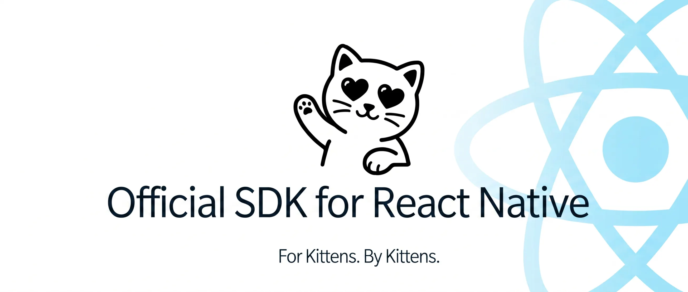

# KittenTTS React Native

<p align="center">
  
</p>

<p align="center">
  <a href="https://huggingface.co/spaces/KittenML/KittenTTS-Demo"></a>
  <a href="https://discord.com/invite/VJ86W4SURW"></a>
  <a href="https://kittenml.com"></a>
  <a href="https://github.com/KittenML/kittentts-react-native"></a>
  <a href="LICENSE"></a>
  
</p>

On-device text-to-speech for React Native, powered by KittenTTS and ONNX
Runtime. Generate speech on iOS and Android without a cloud TTS API. The first
run downloads the model and phonemizer data; later runs use the local device
cache.

> **Status:** Developer preview. APIs may change between releases.

## Contents

- [Features](#features)
- [Requirements](#requirements)
- [Expo Go](#expo-go)
- [Installation](#installation)
- [Quick Start](#quick-start)
- [Basic Tutorial](#basic-tutorial)
- [Detailed Tutorials](#detailed-tutorials)
- [Playback](#playback)
- [Word Highlighting](#word-highlighting)
- [Long Text And Reader Apps](#long-text-and-reader-apps)
- [Models](#models)
- [Voices](#voices)
- [Cache Behavior](#cache-behavior)
- [API Reference](#api-reference)
- [Error Handling](#error-handling)
- [Examples](#examples)
- [Troubleshooting](#troubleshooting)
- [Development](#development)
- [Community And Support](#community-and-support)
- [License](#license)

## Features

- **Fully on-device** -- no API key or server call after setup downloads.
- **8 built-in voices** -- Bella, Jasper, Luna, Bruno, Rosie, Hugo, Kiki, and Leo.
- **4 model variants** -- from Nano int8 to Mini, balancing size and quality.
- **24 kHz WAV output** -- generate raw PCM or encode a standard WAV file.
- **Word timestamps** -- align generated audio with input words when the model exposes duration output.
- **Streaming generation** -- yield long text sentence by sentence for faster first playback.
- **React Native native runtime** -- ONNX Runtime on iOS and Android.
- **Expo development build support** -- works with prebuilt Expo apps, not Expo Go.
- **TypeScript-first API** -- types, enums, errors, and player interfaces included.

## Requirements

| Requirement | Version |
| --- | --- |
| React Native | `>= 0.72` |
| iOS | `15.1+` |
| Android | API `24+` |
| Node.js | `20+` recommended for examples |

The SDK installs these runtime dependencies automatically:

- `onnxruntime-react-native`
- `react-native-fs`
- `pako`

## Expo Go

Expo Go will not work.

This SDK depends on native modules that are not bundled inside Expo Go:

- `onnxruntime-react-native`
- `react-native-fs`

Use one of these app types instead:

- Bare React Native app
- Expo development build
- Expo prebuilt native project

## Installation

### Bare React Native

```bash
npm install @kittentts/react-native
```

Do not install or register `onnxruntime-react-native` manually. KittenTTS
depends on it and registers the Android `Onnxruntime` native module from the SDK
package, so app code should only import `@kittentts/react-native`.

For iOS:

```bash
cd ios
pod install
cd ..
```

For playback with `speak()`, install a player:

```bash
npm install react-native-sound
```

### Expo Development Build

```bash
npm install @kittentts/react-native expo-audio
npx expo prebuild
npx expo run:ios
```

For Android:

```bash
npx expo run:android
```

After building the development app, keep using that dev build. Do not switch
back to Expo Go.

## Quick Start

If you are new to React Native native modules, start with one of the examples
first:

- Expo: [`examples/ExpoWordTimingsExample`](examples/ExpoWordTimingsExample)
- Bare React Native: [`examples/BareRNExample`](examples/BareRNExample)

Generate speech and get a WAV file in memory:

```typescript
import { KittenTTS } from '@kittentts/react-native';

const tts = await KittenTTS.create(undefined, (progress) => {
  console.log(`Setup: ${Math.round(progress * 100)}%`);
});

const result = await tts.generate('Hello from KittenTTS on React Native.');

console.log(result.duration);
console.log(result.wordTimings);
console.log(result.wavBase64());

await tts.dispose();
```

`result.wavBase64()` returns a complete WAV file encoded as base64. Save it with
`react-native-fs`, upload it, or pass it to your own audio pipeline.

## Basic Tutorial

This is the smallest useful setup: install the SDK, create one `KittenTTS`
instance, and speak a sentence.

### 1. Install The SDK

Bare React Native:

```bash
npm install @kittentts/react-native react-native-sound
cd ios && pod install && cd ..
```

Expo development build:

```bash
npm install @kittentts/react-native
npx expo install expo-audio expo-dev-client
npx expo prebuild
```

Expo Go will not work because the SDK needs native modules.

### 2. Create A TTS Instance

Expo:

```typescript
import * as ExpoAudio from 'expo-audio';
import { KittenTTS, createExpoAudioPlayer } from '@kittentts/react-native';

const tts = await KittenTTS.create({
  player: createExpoAudioPlayer(ExpoAudio),
});
```

Bare React Native:

```typescript
import Sound from 'react-native-sound';
import { KittenTTS, createRNSoundPlayer } from '@kittentts/react-native';

const tts = await KittenTTS.create({
  player: createRNSoundPlayer(Sound),
});
```

### 3. Speak Text

```typescript
await tts.speak('KittenTTS is running fully on this device.');
```

The first run downloads model assets. Later runs use the local cache.

## Detailed Tutorials

Use these when you want a full beginner walkthrough instead of API snippets:

| Goal | macOS | Windows |
| --- | --- | --- |
| Add simple text-to-speech to an app | [Simple TTS on macOS](docs/simple-tts/mac.md) | [Simple TTS on Windows](docs/simple-tts/windows.md) |
| Build an EPUB/article reader with streaming and word highlighting | [EPUB reader on macOS](docs/epub-reader/mac.md) | [EPUB reader on Windows](docs/epub-reader/windows.md) |

## Playback

Use `generate()` when you only want audio data. Use `speak()` or `play()` when
you want device playback.

### Expo Audio

```typescript
import * as ExpoAudio from 'expo-audio';
import { KittenTTS, createExpoAudioPlayer } from '@kittentts/react-native';

const tts = await KittenTTS.create({
  player: createExpoAudioPlayer(ExpoAudio),
});

await tts.speak('This plays through expo-audio.');
```

### React Native Sound

```typescript
import Sound from 'react-native-sound';
import { KittenTTS, createRNSoundPlayer } from '@kittentts/react-native';

const tts = await KittenTTS.create({
  player: createRNSoundPlayer(Sound),
});

await tts.speak('This plays through react-native-sound.');
```

### Generate First, Then Play

This is the best pattern when your UI needs metadata before playback starts.
For example, word highlighting needs `result.wordTimings`.

```typescript
const result = await tts.generate('Highlight this sentence.');

await tts.play(result, {
  onPlaybackStart: () => {
    // Start your highlighting timer here.
    // This fires when the player reports playback has started.
  },
});
```

### Custom Player

```typescript
import type { AudioPlayer } from '@kittentts/react-native';

const player: AudioPlayer = {
  async playFile(filePath, onPlaybackStart) {
    // Play the WAV file at filePath.
    onPlaybackStart?.();
  },
  async stop() {
    // Stop active playback.
  },
};
```

Call `onPlaybackStart` when audio is actually playing, not when the file merely
starts loading. That keeps word highlighting and playback in sync.

## Word Highlighting

`generate()` returns `wordTimings`, a list of words with start and end times in
seconds.

```typescript
const result = await tts.generate(
  'KittenTTS can return word-level timestamps.',
);

console.log(result.wordTimings);
// [{ word: 'KittenTTS', startTime: 0.0, endTime: 0.8 }, ...]
```

A minimal highlighting flow:

```typescript
const result = await tts.generate(text);
setResult(result);

let timer: ReturnType<typeof setInterval> | null = null;

await tts.play(result, {
  onPlaybackStart: () => {
    const startedAt = Date.now();
    timer = setInterval(() => {
      const seconds = (Date.now() - startedAt) / 1000;
      const active = result.wordTimings.find(
        word => seconds >= word.startTime && seconds < word.endTime,
      );
      setActiveWordIndex(active?.wordIndex ?? null);
    }, 50);
  },
});

if (timer) clearInterval(timer);
setActiveWordIndex(null);
```

Important notes:

- `wordTimings` are model-predicted timings, not forced alignment from a speech
  recognizer. They are good for UI highlighting, but should not be treated as
  studio-grade subtitles.
- Keep text chunks short for best timing quality. Sentence or paragraph chunks
  work better than full chapters.
- For the full UI, see
  [`examples/ExpoWordTimingsExample`](examples/ExpoWordTimingsExample).

## Long Text And Reader Apps

For EPUB readers, articles, chat messages, and other long text, do not generate
a whole chapter as one audio result. Generate sentence-sized chunks and play or
queue them as they become ready.

```typescript
for await (const chunk of tts.generateStreaming(chapterText, KittenVoice.Luna)) {
  // chunk.inputText is the sentence/paragraph part that was generated.
  // chunk.wordTimings belong only to this chunk.
  await tts.play(chunk);
}
```

For a production reader app, build a small queue around `generateStreaming()`:

```typescript
const queue: KittenTTSResult[] = [];

for await (const chunk of tts.generateStreaming(chapterText)) {
  queue.push(chunk);
  // Start playing the first chunk while later chunks continue generating.
}
```

Recommended reader-app pattern:

- Split by paragraph or use `generateStreaming()` for sentence-sized chunks.
- Display `chunk.inputText` and `chunk.wordTimings` for the currently playing
  chunk.
- Generate the next chunk while the current chunk plays.
- Use `tts.stopSpeaking()` when the user changes page, chapter, voice, or speed.
- Store your own text position, because `wordIndex` is per generated chunk.

The current SDK gives you the generation and playback primitives. It does not
yet include a full audiobook queue with pause/resume/seek/chapter state.

## Models

Start with `NanoInt8` for the smallest download. Use `Mini` when quality matters
more than package size.

| Model | Enum | Parameters | Approx Download | Hugging Face |
| --- | --- | --- | --- | --- |
| Nano int8 | `KittenModel.NanoInt8` | 15M | 28 MB | [kitten-tts-nano-0.8-int8](https://huggingface.co/KittenML/kitten-tts-nano-0.8-int8) |
| Nano fp32 | `KittenModel.Nano` | 15M | 59 MB | [kitten-tts-nano-0.8](https://huggingface.co/KittenML/kitten-tts-nano-0.8) |
| Micro | `KittenModel.Micro` | 40M | 44 MB | [kitten-tts-micro-0.8](https://huggingface.co/KittenML/kitten-tts-micro-0.8) |
| Mini | `KittenModel.Mini` | 80M | 83 MB | [kitten-tts-mini-0.8](https://huggingface.co/KittenML/kitten-tts-mini-0.8) |

## Voices

| Voice | Enum | Character |
| --- | --- | --- |
| Bella | `KittenVoice.Bella` | Warm and expressive |
| Jasper | `KittenVoice.Jasper` | Clear and conversational |
| Luna | `KittenVoice.Luna` | Calm and smooth |
| Bruno | `KittenVoice.Bruno` | Deep and steady |
| Rosie | `KittenVoice.Rosie` | Bright and friendly |
| Hugo | `KittenVoice.Hugo` | Authoritative |
| Kiki | `KittenVoice.Kiki` | Lively and energetic |
| Leo | `KittenVoice.Leo` | Relaxed and natural |

```typescript
await tts.speak('Luna speaking.', KittenVoice.Luna);
await tts.speak('Slower Bella speaking.', KittenVoice.Bella, 0.8);
```

## Cache Behavior

The SDK does not download the model every time.

On first use, `KittenTTS.create()` checks the local cache and downloads only
missing files. Later calls reuse files from disk. Concurrent calls for the same
model share one in-flight download. Each model file is downloaded through a
temporary `.download` file, uses native network timeouts, and retries 4 times by
default before surfacing `DOWNLOAD_FAILED`. Progress is based on actual bytes
reported by the native downloader, so model and phonemizer downloads move as the
network transfer moves.

Default model cache:

```text
<DocumentDirectory>/KittenTTS/<model>/
```

Default phonemizer cache:

```text
<DocumentDirectory>/KittenTTS/CEPhonemizer/
```

Check the cache before showing first-run UI:

```typescript
import { KittenModel, KittenTTS } from '@kittentts/react-native';

const cached = await KittenTTS.isModelDownloaded({
  model: KittenModel.NanoInt8,
});
```

For detailed UI state:

```typescript
const cache = await KittenTTS.getModelCacheInfo({
  model: KittenModel.NanoInt8,
});

console.log(cache.isCached, cache.onnxExists, cache.voicesExists);
```

Pre-download the model and phonemizer:

```typescript
await KittenTTS.predownload({ model: KittenModel.NanoInt8 }, setProgress);
```

Force a clean redownload after a failed or interrupted setup:

```typescript
await KittenTTS.redownloadModel({ model: KittenModel.NanoInt8 }, setProgress);
```

Or clear the cached files and let the next `create()` download again:

```typescript
await KittenTTS.clearModelCache({ model: KittenModel.NanoInt8 });
```

## API Reference

### `KittenTTS.create(options?, onProgress?)`

Creates and initializes a TTS instance. Downloads missing assets, loads voice
embeddings, and creates the ONNX Runtime session.

```typescript
const tts = await KittenTTS.create({
  model: KittenModel.NanoInt8,
  defaultVoice: KittenVoice.Luna,
  speed: 1.1,
  player: createExpoAudioPlayer(ExpoAudio),
});
```

The progress callback receives the numeric progress first. A second optional
argument describes what is happening, including `stage: 'cached'` when the model
is already downloaded.

```typescript
const tts = await KittenTTS.create(options, (progress, info) => {
  if (info?.stage === 'cached') {
    console.log('Model is already downloaded');
  }
  console.log(Math.round(progress * 100));
});
```

Common options:

| Option | Default | Description |
| --- | --- | --- |
| `model` | `KittenModel.Nano` | Model variant |
| `defaultVoice` | `KittenVoice.Bella` | Voice used when omitted |
| `speed` | `1.0` | Speech speed from `0.5` to `2.0` |
| `storageDirectory` | Document directory | Custom model cache root |
| `modelBaseURL` | Hugging Face URL | Custom mirror/self-hosted model file directory |
| `downloadRetries` | `4` | Total download attempts per model file |
| `ortNumThreads` | `4` | ONNX Runtime thread count |
| `maxTokensPerChunk` | `400` | Long-text chunk size |
| `trimTrailingSilence` | `true` | Trim near-silent audio at chunk ends |
| `silenceThreshold` | `0.005` | Amplitude threshold used for silence trimming |
| `maxSilenceTrimMs` | `250` | Maximum trailing silence removed per chunk |
| `phonemizer` | `CEPhonemizer` | Custom text-to-IPA converter |
| `forceRedownload` | `false` | Redownload model files before this `create()` call |
| `player` | none | Required for `speak()` and `play()` |

### `tts.generate(text, voice?, speed?)`

Synthesizes speech and returns a `KittenTTSResult` without playing audio.

```typescript
const result = await tts.generate('Save this as audio.', KittenVoice.Jasper);
for (const word of result.wordTimings) {
  console.log(`${word.word}: ${word.startTime}s - ${word.endTime}s`);
}
```

`wordTimings` is empty when duration output is unavailable or the text is long
enough to be split across multiple model chunks.

### `tts.generateStreaming(text, voice?, speed?)`

Synthesizes long text sentence by sentence. This mirrors the Swift SDK streaming
API while using a TypeScript `AsyncGenerator`.

```typescript
for await (const chunk of tts.generateStreaming(longText, KittenVoice.Luna)) {
  console.log(chunk.inputText, chunk.duration);
  // Play, enqueue, or save each chunk as soon as it is ready.
}
```

### `tts.speak(text, voice?, speed?)`

Synthesizes speech and plays it through the configured `AudioPlayer`.

```typescript
await tts.speak('Play this sentence.', KittenVoice.Rosie, 1.1);
```

### `tts.play(result, options?)`

Plays a previously generated `KittenTTSResult`.

```typescript
const result = await tts.generate('Highlight words while this plays.');
highlight(result.wordTimings);
await tts.play(result, {
  onPlaybackStart: () => startWordHighlighting(result.wordTimings),
});
```

`onPlaybackStart` is optional but recommended for synced UI because it fires
when playback starts, not when generation finishes.

### `KittenTTSResult`

| Property or method | Description |
| --- | --- |
| `samples` | Raw mono `Float32Array` PCM |
| `sampleRate` | Always `24000` |
| `duration` | Audio duration in seconds |
| `voice` | Voice used for generation |
| `effectiveSpeed` | Speed after model-specific adjustments |
| `inputText` | Input text that was synthesized |
| `wordTimings` | Per-word `{ wordIndex, word, startTime, endTime }[]`; empty when unavailable |
| `wavData()` | Complete 16-bit PCM WAV as `Uint8Array` |
| `wavBase64()` | Complete WAV as a base64 string |

### Other Methods

| Method | Description |
| --- | --- |
| `KittenTTS.isModelCached(config?)` | Checks whether model files exist locally |
| `KittenTTS.isModelDownloaded(config?)` | App-facing alias for model cache checks |
| `KittenTTS.getModelCacheInfo(config?)` | Returns cache paths and per-file existence |
| `KittenTTS.predownload(config?, onProgress?)` | Downloads model and phonemizer assets |
| `KittenTTS.prewarm(config?, onProgress?)` | Deprecated alias for `predownload()` |
| `KittenTTS.redownloadModel(config?, onProgress?)` | Deletes and downloads the selected model again |
| `KittenTTS.clearModelCache(config?)` | Deletes cached files for the selected model |
| `tts.play(result)` | Plays a generated result through the configured player |
| `tts.stopSpeaking()` | Stops active playback |
| `tts.dispose()` | Releases playback and ONNX resources |

## Error Handling

SDK failures use `KittenTTSError`. Check `error.code` for user-friendly app
behavior.

```typescript
import {
  KittenTTSErrorCode,
  isKittenTTSError,
} from '@kittentts/react-native';

try {
  await tts.speak('Hello.');
} catch (error) {
  if (isKittenTTSError(error)) {
    if (error.code === KittenTTSErrorCode.DownloadFailed) {
      console.log('Check your internet connection and try again.');
    } else {
      console.log(error.message);
    }
  }
}
```

| Code | Meaning |
| --- | --- |
| `EMPTY_INPUT` | Text was empty |
| `DOWNLOAD_FAILED` | Model or phonemizer download failed |
| `INVALID_MODEL_DATA` | Cached model data could not be parsed |
| `PHONEMIZER_FAILED` | Text-to-phoneme conversion failed |
| `INFERENCE_FAILED` | ONNX Runtime setup or inference failed |
| `PLAYBACK_FAILED` | Audio playback failed |

## Examples

| Example | Purpose | Run |
| --- | --- | --- |
| [`examples/BareRNExample`](examples/BareRNExample) | Bare React Native app | `npm run android` / `npm run ios` |
| [`examples/ExpoExample`](examples/ExpoExample) | Expo SDK 54 dev build | `npm run android` / `npm run ios` |
| [`examples/ExpoWordTimingsExample`](examples/ExpoWordTimingsExample) | Expo SDK 55 word timings demo | `npm run android` / `npm run ios` |

Each example README includes short commands for running the app and building a
debug APK.

## Troubleshooting

### `speak()` says no audio player is configured

Pass a player to `KittenTTS.create()` or use `generate()` instead.

```typescript
const tts = await KittenTTS.create({
  player: createExpoAudioPlayer(ExpoAudio),
});
```

### Expo Go fails

Use a development build:

```bash
npx expo prebuild
npx expo run:ios
```

### First run is slow

That is expected. The selected model and phonemizer data are downloaded once and
cached locally.

### Downloads fail or restart

The SDK retries each model and phonemizer file 4 times by default. Downloads are
written to temporary files first, so partial files are not treated as valid
cache. If a device was interrupted during setup, force a clean model download:

```typescript
await KittenTTS.redownloadModel({ model: KittenModel.NanoInt8 }, setProgress);
```

### iOS reload or Android Gradle issues around ONNX Runtime

The package runs `scripts/patch-onnxruntime-react-native.js` on `postinstall`
to apply known compatibility fixes for `onnxruntime-react-native`.

On Android, the SDK's own `android/` package also registers ONNX Runtime for
you. This avoids the common `Cannot read property 'install' of null` crash that
happens when ONNX Runtime is compiled but its React Native package is not added
to `MainApplication`.

## Development

### Fresh Clone Check

Use this after cloning the repo on a new machine:

```bash
npm install
npm run typecheck
npm test
```

`npm test` is the quick clone-friendly check. It compiles the TypeScript needed
by the unit tests and does not require Emscripten.

### Publishing Prerequisites

Publishing needs one extra tool because the package build regenerates the
CEPhonemizer JavaScript runtime from C++.

Before publishing, make sure these commands work:

```bash
node -v
npm -v
emcc --version
```

On macOS, install Emscripten with:

```bash
brew install emscripten
```

Then run the publish checks:

```bash
npm install
npm test
npm pack --dry-run
```

The default phonemizer runtime is generated from `vendor/cephonemizer`:

```bash
npm run build:phonemizer
```

`build:phonemizer` requires Emscripten. The full packaging build also requires
Emscripten:

```bash
npm run build
```

The full `npm run build` command regenerates the phonemizer runtime, compiles
TypeScript into `lib/`, and copies the generated Emscripten runtime into `lib/`
because TypeScript does not copy plain `.js` assets.

Generated files are not committed:

- `lib/`
- `*.tgz`
- `src/phonemizer/generated/cephonemizer-runtime.js`

Source files that should stay committed:

- `src/`
- `src/phonemizer/generated/cephonemizer.ts` (small typed wrapper)
- `vendor/cephonemizer/` (C++ source used to regenerate the runtime)

Common commands:

```bash
# Regenerate lib/ and the phonemizer runtime
npm run build

# Create a local .tgz package for manual package inspection
npm pack

# Publish the public scoped package to npm after login
npm run publish:npm
```

To publish to npm, log in once with `npm login`, then run:

```bash
npm run publish:npm
```

That single command runs `npm publish --access public`, which is required for
the public scoped package `@kittentts/react-native`. `prepublishOnly` runs the
test suite, and `prepack` rebuilds the phonemizer runtime plus `lib/` before npm
creates the package.

To create a local package tarball for manual inspection:

```bash
npm pack
```

This writes a file like `kittentts-react-native-0.8.0.tgz` in the repository
root. The tarball is ignored by git. The included examples install
`@kittentts/react-native` from npm, not from this tarball.

If npm cache permissions fail locally, use:

```bash
npm --cache /tmp/kittentts-npm-cache pack
```

## Community And Support

- Website: [stellonlabs.com](https://stellonlabs.com)
- Repository: [KittenML/kittentts-react-native](https://github.com/KittenML/kittentts-react-native)
- Discord: [Join the community](https://discord.com/invite/VJ86W4SURW)
- Demo: [Hugging Face Spaces](https://huggingface.co/spaces/KittenML/KittenTTS-Demo)
- Issues: [GitHub Issues](https://github.com/KittenML/kittentts-react-native/issues)
- Commercial support: [contact form](https://docs.google.com/forms/d/e/1FAIpQLSc49erSr7jmh3H2yeqH4oZyRRuXm0ROuQdOgWguTzx6SMdUnQ/viewform?usp=preview)

## License

Apache 2.0. See [LICENSE](./LICENSE).
